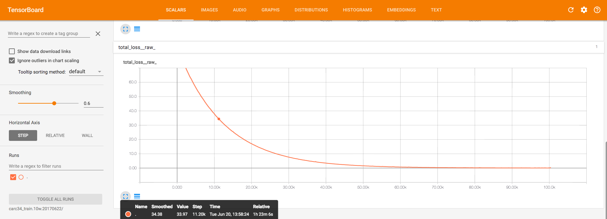
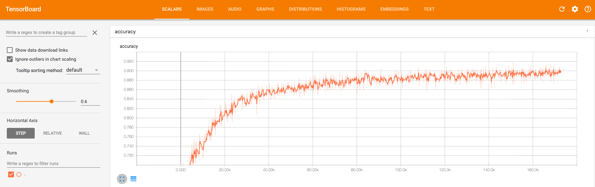

# CARC34
Image classify and localize model based on cifar10, the sample model from the official tutorial of tensorflow. 

Because all images were taken according to a very strict specification, the performance of this simple model is very good.

# Classification
Images about a car outside or inside and from different angles with 34 target classes.

@see classify directory

## Model
4 conv layer and 2 fully connected layer.

Inputs of trainning is (image[256,256,3], label_id[1]).

The target of prediction is a float vector [34], the index number of biggest value in this vector is the predict class id.

## Benchmark
Every example contains a image sized 256x256 and a text label.

### dataset - 34w - 19 classes
 precision @ 1 = 0.994 ~ 0.997

### dataset - 32w - 34 classes
 precision @ 1 = 0.987 ~ 0.994

# Localization
Do localization work for 7 appearance class [23-29].

@see localize directory

## Model
7 conv layer, 2 fully connected layer and 2 dropout op, ....

Inputs of trainning is (image[256,256,3], box[4]).

The target is a float vector [4], representing the offset in percent of 4 edge of object box (top, bottom, left, right). 

The left-top corner is (0,0) and the right-bottom corner is (1,1).

## Benchmark
*   MeanIOU = 0.90 ~ 0.91
*   IOU = Intersection(Predict, GroundTruth) / Union(Prediction, GroundTruth)

# HowToRun
*   Install tensorflow (with gpu-support will speed up training task)
*   Clone: git clone this-project
*   WorkDir: 
    * TFWORKDIR=/home/xxx/your-project/tmp  # your work dir
    * mkdir -p $TFWORKDIR 
*   Download and ExtractData to ${TFWORKDIR}/carc34: 
    * ls ${TFWORKDIR}/carc34
    *    label_for_test.dat label_for_train.dat box_for_test.dat box_for_train.dat image/
*   Modify carc_flags (localize/classify): 
    * tf_home: /home/xxx/your-project
*   Train:
    * python train.py
*   Evaluate:
    * python evaluate.py
*   Export model named "frozen_custom.pb" to train_dir specified in carc_flags.py:
    * python build_model.py
*   Serving
    * cd serving
    * python web_classify.py &>web_classify.log &
    * python web_localize.py &>web_localize.log &
    * sh test.sh
    * curl --compressed -v -F "images[]=@images/o_1bc4q9nfb1181222690274524715012536.jpg" -F "images[]=@images/o_1bf69iger15584463531465908144086.jpg"  http://localhost:5000/classify
    * curl --compressed -v -F "images[]=@images/o_1bc4q9nfb1181222690274524715012536.jpg" -F "images[]=@images/o_1bf69iger15584463531465908144086.jpg"  http://localhost:5001/localiz

# Reference
* https://www.tensorflow.org/tutorials/deep_cnn
* https://www.youtube.com/playlist?list=PLkt2uSq6rBVctENoVBg1TpCC7OQi31AlC&spfreload=10

# email
* xiusir#qq.com
